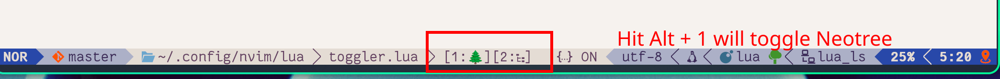

# Toggler.nvim
**TBD**

## Introduction
This plugin is inspired by the quick launcher of the status bar in KDE and Windows, on which you can press Super + Number to open a certain program.
On Neovim, there might be some frequently used plugins, like NeoTree, Telescope, etc., that you constantly toggle open and close, but don't want to memorize their keybindings.
Then `toggler.nvim` is the solution for you. A quick launcher indicates plugins and their corresponding number; you merely need to press Prefix + the number key.
Prefix can be `ALT`, `CTRL`, or `SUPER`.

### Features
1. Provides different options to display the quick launcher.
2. Configurations to customize keybindings.
    - Customize prefix key.
    - Customize plugin list.
3. (TODO) Create a dedicated UI element displaying the quick launcher.

## Installation and configuration
Install with `lazy.nvim`
```lua
{
    "ZwindL/toggler.nvim",
    config = function()
        require("toggler").setup({})
    end,
}

```

Configuration
```lua
require("toggler").setup({
    prefix = "alt",    -- can be "alt"(default), "mod"(same as "alt"), "ctrl", "super", "shift"
    debug = false,
    maps = {            -- list of plugins and their corresponding keys
        {
            number = 1,
            icon = '🌲',
            callback = "<cmd>Neotree<cr>",  -- can be a string or a function
        },
        {
            number = 2,
            icon = '󰙅',
            callback = "<cmd>Outline<cr>",
        },
        {
            number = 3,
            icon = '󰙨',
            callback = function ()
                require("telescope.builtin").find_files()
            end,
        },
    },
})
```

Display UI on lualine

```lua
-- In Laline config:
require("lualine").setup({
    sections = {
        lualine_x = {
            function ()
                return require("toggler").ui_line_text()
            end
        }
    }
})
```
